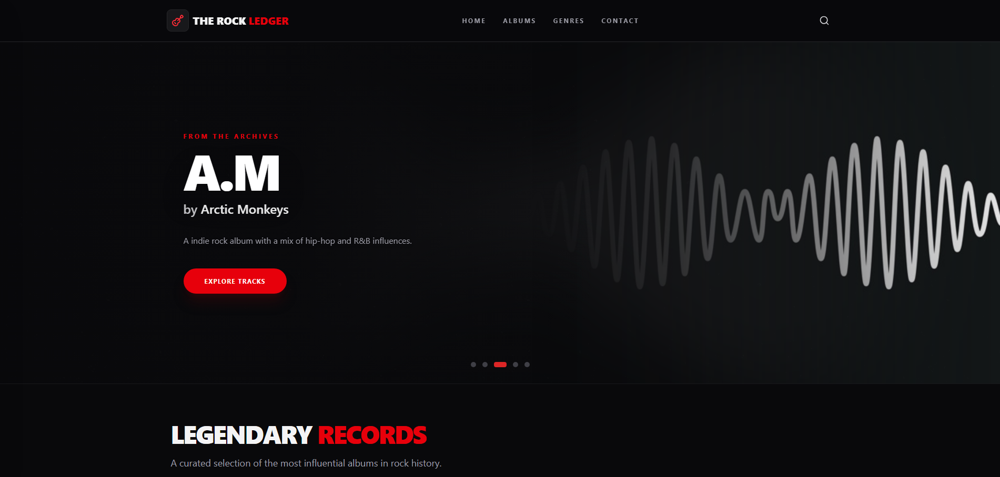

# 🎸 The Rock Ledger

<p align="center">
  
</p>

<p align="center">
  <strong>Uma enciclopédia digital premium e imersiva para os verdadeiros entusiastas de Rock e Metal. 🤘</strong>
</p>

<p align="center">
  <a href="#sobre">Sobre</a> •
  <a href="#funcionalidades">Funcionalidades</a> •
  <a href="#tecnologias">Tecnologias</a> •
  <a href="#estrutura">Estrutura</a> •
  <a href="#como-rodar">Como Rodar</a> •
  <a href="#deploy">Deploy</a> •
  <a href="#autora">Autora</a>
</p>

<p align="center">
  
  
  
  
</p>

---

## <a id="sobre"></a>🎯 Sobre o Projeto

O **The Rock Ledger** é uma plataforma interativa desenvolvida para catalogar, explorar e celebrar os álbuns mais icônicos da história do Rock. O projeto foi pensado com um foco gigante em **User Interface (UI)** e **Experiência do Usuário (UX)**, trazendo uma estética *100% Dark Mode*, transições fluidas e total integração com o ecossistema musical.

Desenvolvido como parte do meu aprendizado em **Análise e Desenvolvimento de Sistemas na FIAP**, este projeto aplica conceitos avançados do front-end moderno, incluindo componentização inteligente, roteamento, gerenciamento de estados e design altamente responsivo.

---

## <a id="funcionalidades"></a>✨ Funcionalidades

* 🎬 **Featured Slider:** Um carrossel cinematográfico na página inicial, com efeitos de fade e suavização de bordas para destacar grandes obras.
* 💿 **Biblioteca Expansiva:** Um catálogo rico englobando grandes clássicos nacionais e internacionais.
* 🎧 **Integração com Spotify:** Player embutido que permite a audição de faixas e prévias diretamente na interface da plataforma.
* 📩 **Newsletter "The Horde":** Sistema de captura de e-mails para fãs, com validação de formulário em tempo real e feedback visual dinâmico via *SweetAlert2*.
* 🌑 **Absolute Dark Mode:** Uma interface desenhada nativamente para o escuro. Design de alto contraste, tipografia elegante e detalhes marcantes em vermelho e preto.
* 📱 **Design Responsivo:** Layout milimetricamente adaptado para oferecer a melhor experiência em qualquer tela — de *Extra Small Devices* (smartphones) até *Extra-large Devices* (desktops e monitores ultrawide).
* 🖱️ **Branding Details:** Cuidados com micro-interações, incluindo a customização da cor de seleção de texto para manter a fidelidade visual da marca.

---

## <a id="tecnologias"></a>🛠️ Tecnologias Utilizadas

A aplicação foi construída utilizando o que há de mais moderno no ecossistema Front-end:

**Core & Lógica:**
* ⚛️ **React** (Biblioteca principal)
* ⚡ **Vite** (Ferramenta de build ultra-rápida)
* 📘 **TypeScript** (Tipagem estática para escalabilidade e segurança)
* 🛣️ **React Router Dom** (Gerenciamento de rotas e navegação)

**Estilização & UI:**
* 🎨 **Tailwind CSS** (Estilização utilitária e sistema de grid responsivo)
* 🖼️ **Lucide React** (Biblioteca de ícones minimalistas)
* 🎠 **Swiper.js** (Engine de alta performance para os carrosséis)
* 🚨 **SweetAlert2** (Alertas modais customizados para o Dark Mode)

---

## <a id="estrutura"></a>📂 Estrutura do Projeto

A arquitetura do projeto foi pensada para ser limpa e escalável:

```text
src/
├── assets/          # 🎨 Recursos estáticos (estilos globais, fontes e imagens)
├── components/      # 🧩 Componentes reutilizáveis (Header, Footer, Cards, etc.)
├── data/            # 🗄️ Banco de dados local em formato JSON (records.json)
├── pages/           # 📄 Páginas da aplicação (Home, Contact, Genres, etc.)
├── types/           # 🏷️ Interfaces TypeScript para tipagem de dados
├── App.tsx          # ⚙️ Configuração central de Rotas e Layout
└── main.tsx         # 🚀 Ponto de entrada (Entry point) da aplicação
```

---

## <a id="como-rodar"></a>🚀 Como Rodar o Projeto

Siga os passos abaixo para testar o projeto localmente na sua máquina.

1. **Clone o repositório:**
```bash
git clone https://github.com/juliarichesky/the-rock-ledger
```

2. **Acesse a pasta do projeto:**
```bash
cd the-rock-ledger
```

3. **Instale as dependências:**
```bash
npm install
```

4. **Inicie o servidor de desenvolvimento:**
```bash
npm run dev
```

5. **Acesse no navegador:**
👉 Abra `http://localhost:5173` e aproveite a experiência!

---

## <a id="deploy"></a>🌐 Deploy

A aplicação está no ar e totalmente funcional! Você pode explorar a enciclopédia, testar o player e conferir o layout hospedado na **Vercel**. 

Clique no botão ou no link abaixo para acessar:

[](https://the-rock-ledger.vercel.app/)

👉 **[Acessar o The Rock Ledger](https://the-rock-ledger.vercel.app/)**

---

## <a id="autora"></a>👩‍💻 Autora

<p>
  Desenvolvido com 🤘 e muito código por <strong>Julia Richesky</strong>.
</p>

<table>
  <tr>
    <td align="center">
      <a href="https://www.linkedin.com/in/juliarichesky/" target="_blank" title="LinkedIn Julia Richesky">
        <br>
        <sub>
          <b>LinkedIn Julia Richesky</b>
        </sub>
      </a>
      <br>
      <a href="https://github.com/juliarichesky" target="_blank" title="GitHub Julia Richesky">
        <sub>
          <b>GitHub Julia Richesky</b>
        </sub>
      </a>
    </td>
  </tr>
</table>
